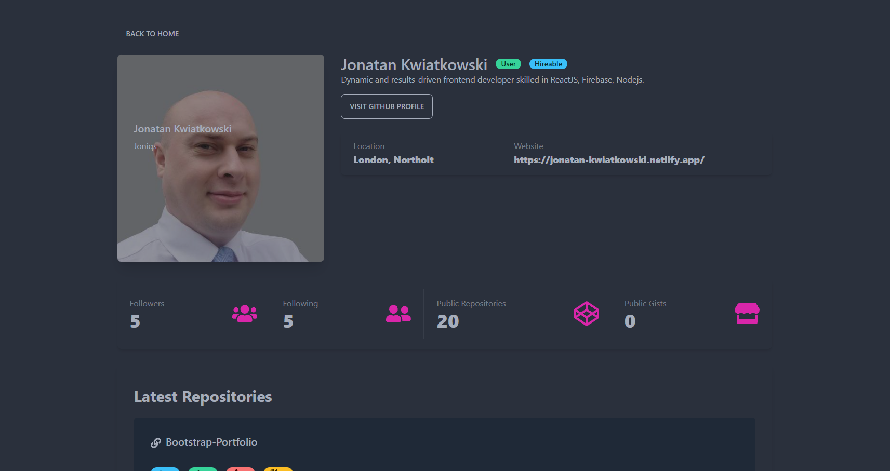

# Github Finder

GitHub Finder is a powerful web application that allows users to search for GitHub profiles and retrieve relevant information about users and their repositories with ease. This project leverages the GitHub API to fetch real-time data and provides an intuitive interface to explore GitHub users' profiles and repositories.

# Demo


**Search Page**



**Profile Page**

## Installation

1. Make sure you have nodejs installed on your machine [link](https://nodejs.org/en)
2. Download project files and go inside project folder

```bash
    git clone git@github.com:Joniqs/Github-finder.git
    cd Github-finder
```

3.Install dependencies

```bash
    npm install
```

4. Obtain a personal access token from GitHub:

- Go to your GitHub account settings.
- Navigate to "Developer settings" and click on "Personal access tokens".
- Generate a new token with the necessary permissions to access the GitHub API.

5. Create a .env file in the root directory of the project and add the following line, replacing REACT_APP_GITHUB_TOKEN with the personal access token you obtained in the previous step:

```bash
REACT_APP_GITHUB_TOKEN = YOUR_GITHUB_TOKEN
REACT_APP_GITHUB_URL = "api.github.com"
```

6. Start the development server:

```bash
npm start
```

7. Open your web browser and visit http://localhost:3000 to access the GitHub Finder application.

8. In the search bar, enter a GitHub username to retrieve the user's profile and repository information.

## Usage/Examples

Feel free to explore the application, click on user profiles to view detailed information, and click on repositories to see specific details. The application is designed to provide a user-friendly experience for effortlessly discovering and exploring GitHub profiles and repositories.

## Credits

Jonatan Kwiatkowski

# License

This project is licensed under the MIT License.
